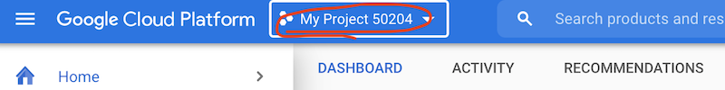
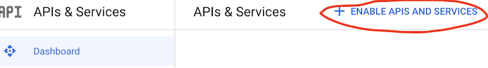
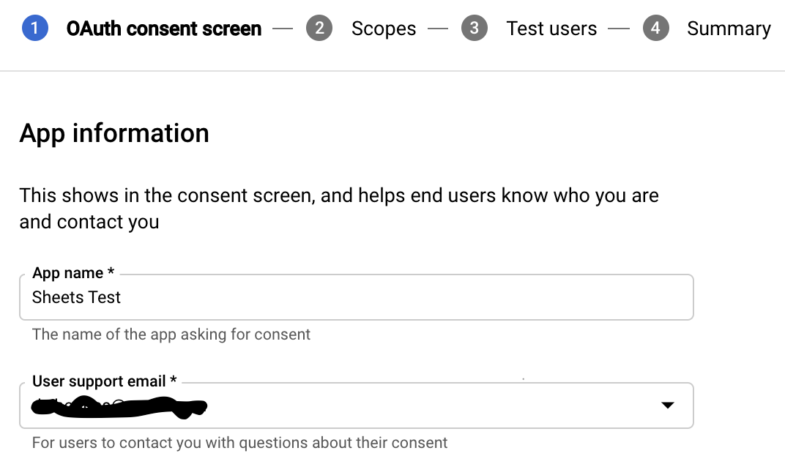
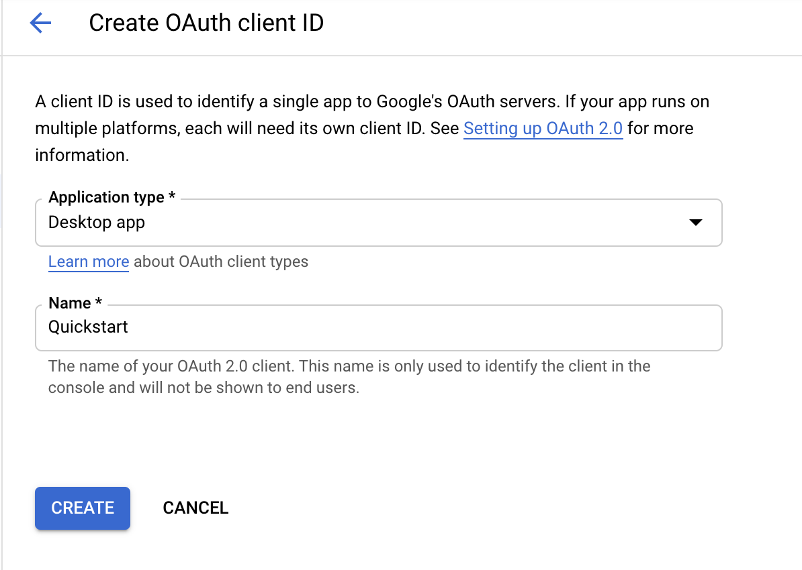
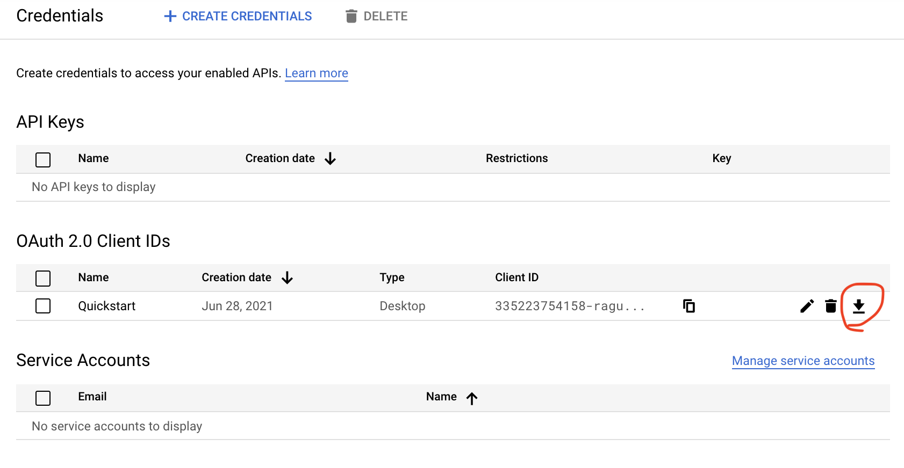
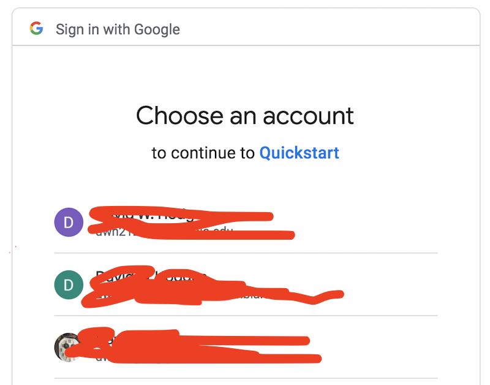

# Lesson 1: Connecting to the Google Sheets API

Before using the API there are a few things to install and configure in your local environment. You will need to be able to authenticate to a Google Apps-enabled account, i.e., an an account that you can use to create, read, and edit Google Sheets documents. Your CU LionMail account should suffice, but you may wish to use a different account instead.

## Installing and configuring sheetFeeder

The Google Sheets API is well documented with plenty of samples and guidelines. It can be a little overwhelming however, and we want to get up and running quickly. To make things easier we will be using a Python library called `sheetFeeder` that abstracts some of the more useful API features into a set of short commands. 

### 1. Set up a virtual environment

Once you have your Anaconda or other Python 3 environment ready, lets create a virtual environment to keep things for this workshop separate.

#### Using `conda`

Create a new virtual environment:

```
conda create --name pugenv
```

You will be asked to confirm, and then the new environment should be created called `pugenv`. Activate the environment:

```
conda activate pugenv
```

Depending on your shell, you may see an indication that you are now within this virtual environment , e.g., "(pugenv)" before the prompt.

Although you may have `pip` installed, we want it installed specifically within this environment, so use:

```
conda install -n pugenv pip
```

(If you have named your virtual environment differently, replace "pugenv" with the correct name.) Then verify that the version of `pip` is located in the pugenv environment:

```
which pip
>>> /opt/anaconda3/envs/pugenv/bin/pip
```

#### Using `venv`

If you are not using `conda` but your own Python3 environment, you can set up a virtual environment using `venv`. Go to a folder where you want to work on this project and do:

```
python3 -m venv pugenv
```

This will create a subfolder called `pugenv`. To activate the virtual environment use

```
source pugenv/bin/activate
```

Note that you will need to have the correct path to the virtual environment folder (unlike in `conda` where you only need to know its name). Verify that `pip` is available within this python3 virtual environment:

```
which pip
```

To deactivate a `venv` virtual environment simpy type "deactivate". 

### 2. Install sheetFeeder package and dependencies

From within your activated virutal environment, install sheetFeeder and its dependencies using

```
pip install -U sheetFeeder
```

Pip will install the `sheetFeeder` package along with the Google API client library and some other dependencies as needed (some of which you may already have, like `requests`).

You will need to know the location where the package files were installed. This should be within your virtual environment directory, e.g., `/opt/anaconda3/envs/pugenv/lib/python3.9/site-packages/sheetFeeder`. You can find the location by typing

```
pip show sheetFeeder
```

Note the location response for the next step.

### 3. Obtain Google API credentials

*(Note: These instructions have changed to reflect changes in the authorization process at Google, and are subject to change further.)*

To begin using the Google Sheets API you need to obtain a `credentials.json` file.


A. *Select or Create a Project and Enable API*
- If you do not already have a project in Google Cloud Console you will need to create one. The process of creating a new project is described in detail at https://developers.google.com/workspace/guides/create-project. 
- Go to [Google Cloud Console](https://console.cloud.google.com/), making sure you are signed in as the identity you wish to use for Sheets integration.
- You may either use an existing project (if you have one) or create a new one. To do either, go to the pull-down menu at the top and either select an existing project or select "New Project."
  
- If creating a new project, you can use the name assigned by Google if you like or create a new name (the name is not very important). If your account is part of an organization (e.g., a University) you may group it with that organization or leave it unassociated with an organization (it shouldn't matter).
- With the project selected, go to APIs and Services in the main menu. In the Dashboard view, click "Enable APIS and Services" at the top. 
  

  This will take you to the API library. Scroll to or search for the Google Sheets API and click through to enable it.

B. *Configure OAuth Consent Screen*
- From the main menu go to > "APIs and Services" > "OAuth Consent Screen".
- Select "Internal" or "External" User Type (this shouldn't matter much for our purposes) and click "Create".
- App Information screen: You only need fill in the required fields (App name and email). Click "Save and Continue".
  

- Scopes screen: No need to change from the defaults here. Click "Save and Continue".
- Test Users screen: No changes required. Click "Save and Continue".
- Summary screen: if all is good you are done with the OAuth consent configuration.

C. *Create Credentials*
- (See more detailed [credentials instructions here](https://developers.google.com/workspace/guides/create-credentials), on which the below are based.)
- From the "APIs and Services" menu on the left, select "Credentials".
- Click "Create Credentials" and select the "OAuth client ID" option.
- For Application Type select "Desktop" and give it the name "Quickstart". Click "Create".
  

- You should now see the "Quickstart" credential listed under OAuth 2.0 Client IDs. Use the Download button at the right end of that row to download the credentials as a JSON file.
  

D. *Add Credentials to sheetFeeder*
- The downloaded file will be called something unwieldy like `client_secret_496925295403-5qcjroitnouj1xof810siou23k5goe7l.apps.googleusercontent.com.json`. You will need to rename this file (or a copy of it) to `credentials.json`:

  ```
  mv <name_of_client_secret_file> credentials.json
  ```

  This will be your credentials file. You can duplicate it for other projects as needed.

- Place the `credentials.json` in the `sheetFeeder` package location as identified in step 2 above. Depending on your locations, the command may look like

  ```
  mv credentials.json /opt/anaconda3/envs/pugenv/lib/python3.9/site-packages/sheetFeeder/
  ```

  In that folder you should now see `credentials.json` alongside `sheetFeeder.py` and `__init__.py` (the installed package files).

### 4. Authorize access

The first time you attempt a request using your credentials you will be prompted to authorize access using an OAuth2 flow. 

- Run `lesson_1.py`, which attempts to read a Google Sheet that allows read access to all authenticated users. 

  ```
  python lesson_1.py
  ```

- This should pop open a browser window asking you to select the Google identity to use (if more than one are detected) and to verify access.  Note that you may see a warning that the application is not verified by Google. You can go to the "advanced" option and proceed with the "Quickstart" authentication process from there.

  

- Click through to grant read/write permission to your Google Sheets account. You should see a message saying "The authentication flow has completed."
- If successful, a `token.json` file should be created in the same folder as the `credentials.json` file (see step 2 above for location), and a brief readout of sample table data will appear in your terminal. Once the credentials and token are in place, you be able to access sheets via the API without additional steps; you can verify this by running `lesson_1.py` again—you should get the read-out without the authentication steps. 

### Reusing and revoking API credentials

Note that your API credentials (`credentials.json` and `token.json`) can be reused in other environments where `sheetFeeder` is installed without repeating the steps above. You may copy them to the appropriate location per step 2 above. To disallow API access and reset to the initial state, simply delete the files. You may also manage API access via the [Google API console](https://console.developers.google.com/).


[Next >>>](Lesson_2.md)