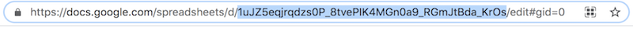
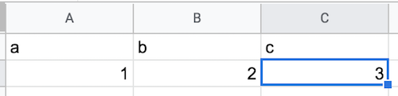

# Lesson 2: Basic Reading and Writing

## Setting up a new Google Sheet doc

Go either to Google Drive or Google Sheets while signed in as the same user from Lesson 1. Create a new sheet, give it a name (any name), and note the UID from the URL:



This will be the ID you use within Python. Edit `lesson_2.py` to set `sheet_id` to this string.

```python
# Replace with the UID of your sheet.
sheet_id = '<your sheet UID goes here>'

test_sheet = dataSheet(sheet_id, 'Sheet1!A:Z')
```

Add some test data to your sheet:



Now run `lesson_2.py`. You should first get your original test data as a result; then some more data will be added automatically; then you will get the combined result. 

```
Getting data from the sheet...
[['a', 'b', 'c'], ['1', '2', '3']]

Getting data as columns...
[['a', '1'], ['b', '2'], ['c', '3']]

Append some data ...
{'spreadsheetId': '1uJZ5eqjrqdzs0P_8tvePIK4MGn0a9_RGmJtBda_KrOs', 'tableRange': 'Sheet1!A1:C2', 'updates': {'spreadsheetId': '1uJZ5eqjrqdzs0P_8tvePIK4MGn0a9_RGmJtBda_KrOs', 'updatedRange': 'Sheet1!A3:C5', 'updatedRows': 3, 'updatedColumns': 3, 'updatedCells': 9}}

The new data looks like...
[['a', 'b', 'c'], ['1', '2', '3'], ['x', 'y', 'z'], ['12', '', 'Hello'], ['55', '34', 'c']]
```


You will see that this is done by using methods defined for the `dataSheet` class you created for your sheet:

 - `.getData()` returns the data for the given range in a list of rows
 - `.getDataColumns()` returns the same data as a list of columns
 - `.appendData(<data>)` adds rows to the end of the existing table.

Some other useful methods:
 - `.clear()` will delete everything within the range. This is useful when overwriting existing data with updates.
 - `.importCSV(<csv_path>)` – populate a sheet with data from a CSV.

A list of all methods are found at the `sheetFeeder` documentation on GitHub. Note that these are methods for `sheetFeeder` and don't represent all methods supported by the Google Sheets API.

Try out a few other operations in your script (or a new script)! Note that Google Sheets maintains version history for changes, so if you do something wrong, you can go to the document and revert to an earlier state.


[<<< Previous](Lesson_1.md) | [Next >>>](Lesson_3.md)